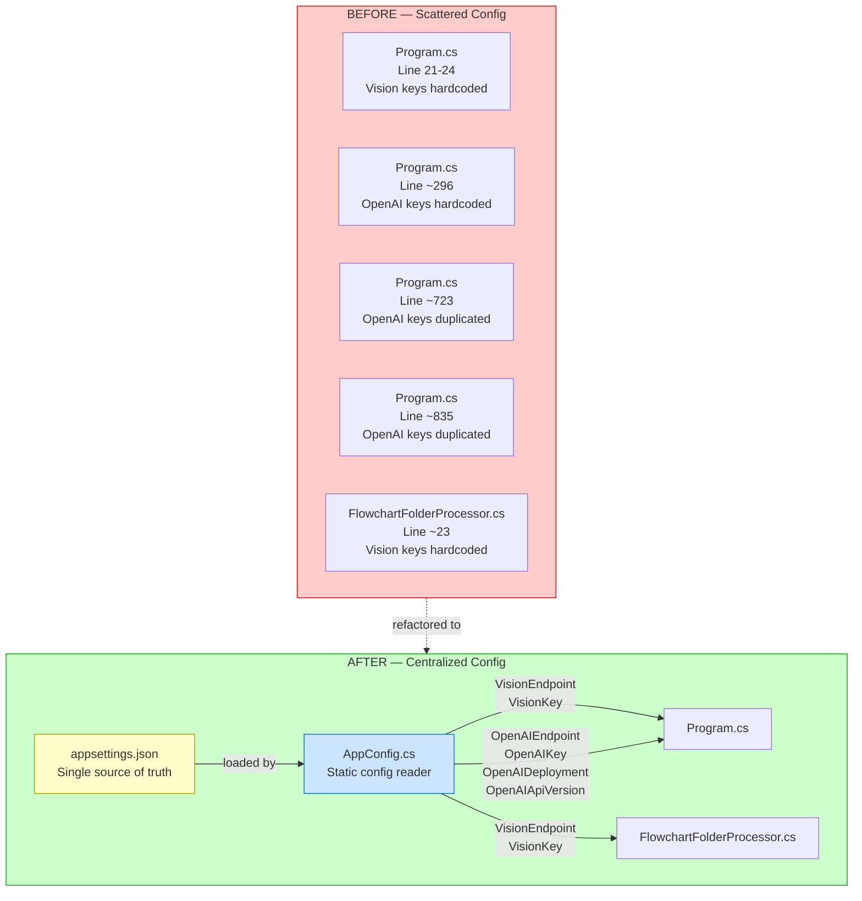
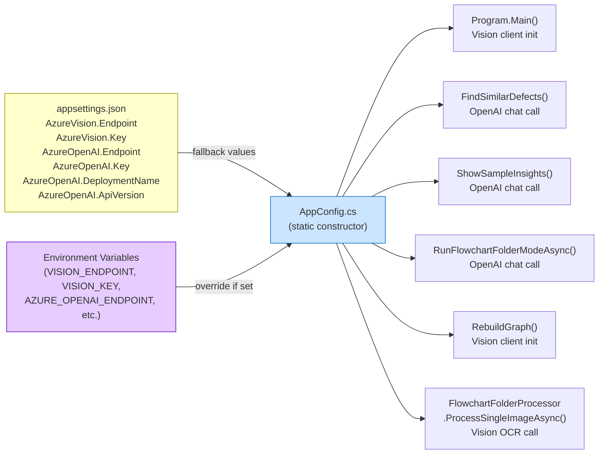
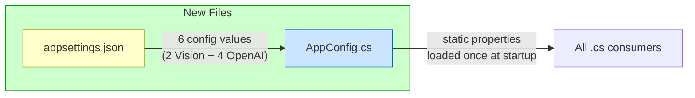
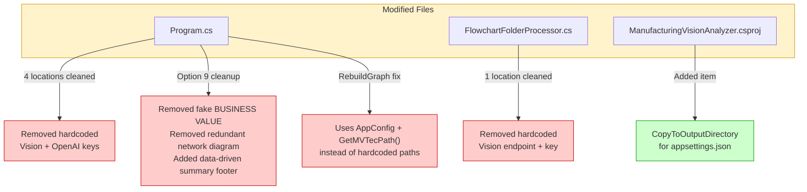
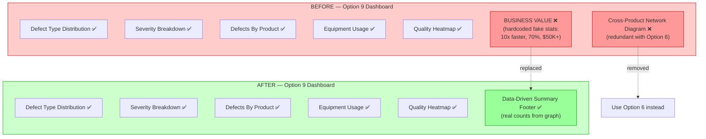
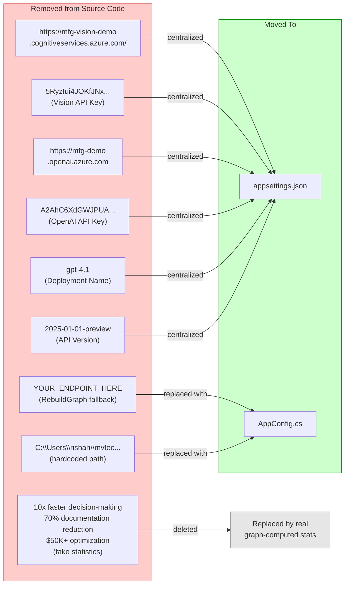
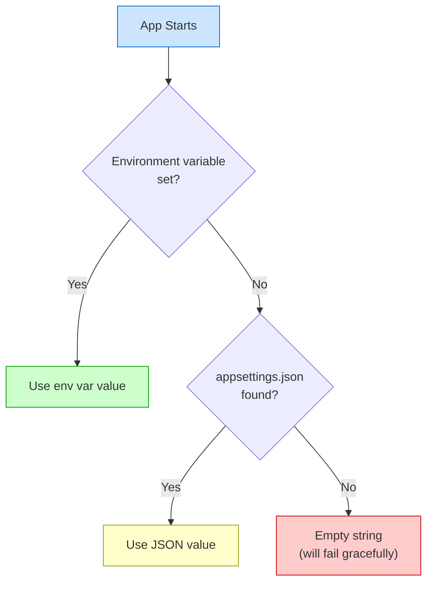

# Manufacturing Vision Analyzer — Changes Log (Feb 20, 2026)

All modifications made during this session, visualized with Mermaid diagrams.

---

## 1. Overall Architecture (Before vs After)

---

## 2. Config Centralization Flow

---

## 3. Files Created Today

---

## 4. Files Modified Today

---

## 5. Option 9 Dashboard — Before vs After

---

## 6. Hardcoded Values Eliminated

---

## 7. AppConfig Priority Chain

---

## 8. Summary of All Changes

| # | Change | File(s) | Type |
|---|--------|---------|------|
| 1 | Created centralized config file | `appsettings.json` | New |
| 2 | Created static config reader class | `AppConfig.cs` | New |
| 3 | Replaced 4 hardcoded key/endpoint blocks | `Program.cs` | Modified |
| 4 | Replaced 1 hardcoded key/endpoint block | `FlowchartFolderProcessor.cs` | Modified |
| 5 | Added CopyToOutputDirectory for config | `ManufacturingVisionAnalyzer.csproj` | Modified |
| 6 | Removed fake BUSINESS VALUE stats | `Program.cs` (Option 9) | Modified |
| 7 | Removed redundant network diagram | `Program.cs` (Option 9) | Modified |
| 8 | Added data-driven summary footer | `Program.cs` (Option 9) | Modified |
| 9 | Fixed RebuildGraph to use AppConfig | `Program.cs` (Option 11) | Modified |
| 10 | Fixed RebuildGraph to use GetMVTecPath() | `Program.cs` (Option 11) | Modified |

**Zero hardcoded API keys, endpoints, or fake statistics remain in any .cs file.**
