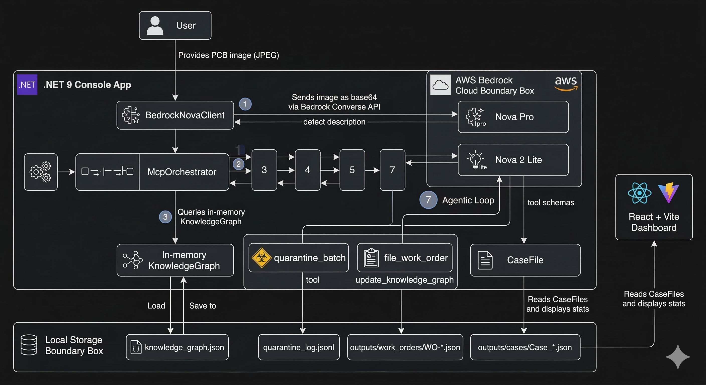

# Agentic PCB Defect Inspector — Amazon Nova on AWS Bedrock

> A **.NET 9** agentic AI system that inspects PCB images, checks IPC compliance, identifies root cause, and autonomously quarantines batches, files work orders, and updates its own knowledge graph — all in ~13 seconds.

🌐 **Live demo:** https://ashahet1.github.io/AmazonNOVAHackathon/  
📦 **Repo:** https://github.com/Ashahet1/AmazonNOVAHackathon

---

## Pipeline Overview



---

## How It Works

Each inspection runs a 7-step pipeline automatically:

| Step | What happens | Model |
|------|-------------|-------|
| 1 | Analyze PCB image — detect defect type, confidence, tags | Nova Pro (multimodal) |
| 2 | Normalize to canonical taxonomy, infer likely equipment | Nova 2 Lite |
| 3 | Query knowledge graph — related defects, IPC sections, co-occurrences | In-memory graph |
| 4 | Root cause reasoning — contributing factors + 3 prioritized actions | Nova 2 Lite |
| 5 | IPC-A-600J / IPC-6012E compliance check (RAG) — accept or reject | Nova 2 Lite |
| P/G | Policy checks + final review gate | Rule engine |
| 7 | **Agentic loop** — calls real tools autonomously | Nova 2 Lite |

**Step 7 tools:**
- `quarantine_batch` → appends to `quarantine_log.jsonl`
- `file_work_order` → creates `WO-*.json` with priority (P1/P2/P3) and assignee
- `update_knowledge_graph` → adds co-occurrence edges, records severity feedback

---

## Real Output

```
⚙️  quarantine_batch    → ✅ BATCH-20260303-0CD549 quarantined (high severity)
⚙️  update_knowledge_graph → ✅ open → severity increase recorded
⚙️  file_work_order     → ✅ WO filed (P1, process_engineer): calibrate etching machine
⚙️  file_work_order     → ✅ WO filed (P2, qa_team): check etching solution
⚙️  file_work_order     → ✅ WO filed (P3, maintenance): update maintenance schedule
✅ Agentic loop complete — 5 action(s) taken in ~13s
```

Nova selected every tool, assigned priorities and assignees, with zero human instruction.

---

## Dataset

**DeepPCB** (open-source, Peking University) — real PCB defect images  
6 defect classes: `open` · `short` · `mousebite` · `spur` · `pin_hole` · `spurious_copper`  
50 images → **388 graph nodes, 1308 relationships, ~327 defects**

---

## Quick Start

**Prerequisites:** .NET 9 SDK · AWS account with Bedrock access in `us-east-1` · Nova Pro + Nova 2 Lite enabled in Bedrock Model Access

```bash
git clone https://github.com/Ashahet1/AmazonNOVAHackathon
cd AmazonNOVAHackathon
```

Edit `appsettings.json` with your AWS credentials, then:

```bash
dotnet run
# → Select 1 to load cached graph (instant)
# → Select 1 from main menu to run a full inspection
```

---

## Stack

| | |
|---|---|
| Language | C# / .NET 9 |
| AI | Amazon Bedrock — Nova Pro + Nova 2 Lite |
| API | Bedrock Converse API |
| Dataset | DeepPCB (open-source, Peking University) |
| Standards | IPC-A-600J · IPC-6012E |
| Dashboard | React + Vite → GitHub Pages |
| NuGet | `AWSSDK.BedrockRuntime` only |

---

## Project Structure

```
Program.cs                 ← Entry point + 6-option console menu
BedrockNovaClient.cs       ← All Bedrock calls (vision, reasoning, agentic loop)
AgentTools.cs              ← Tool definitions + dispatcher
McpOrchestrator.cs         ← 7-step pipeline orchestration
CaseFile.cs                ← Case model with full trace
KnowledgeGraph.cs          ← In-memory graph, JSON persistence
IpcComplianceReference.cs  ← IPC sections used as RAG context
Guardrails.cs              ← Policy checks
outputs/
  cases/                   ← Case_*.json per inspection
  work_orders/             ← WO-*.json filed by Step 7
  quarantine_log.jsonl     ← Quarantine events
dashboard/                 ← React + Vite live dashboard
```

---

## References

- [Amazon Bedrock](https://aws.amazon.com/bedrock/)
- [Amazon Nova](https://aws.amazon.com/bedrock/nova/)
- [Bedrock Converse API](https://docs.aws.amazon.com/bedrock/latest/userguide/conversation-inference.html)
- [DeepPCB Dataset](https://github.com/tangsanli5201/DeepPCB) — Ding et al., CAAI Transactions 2019
- IPC-A-600J / IPC-6012E — PCB acceptability and performance standards

---

**Built by Riddhi Shah · Amazon Nova AI Hackathon · March 2026**

---

## Models Used

| Model | Model ID | Used In |
|---|---|---|
| Amazon Nova Pro | `us.amazon.nova-pro-v1:0` | Step 1 — multimodal vision (base64 image input) |
| Amazon Nova 2 Lite | `us.amazon.nova-2-lite-v1:0` | Steps 2, 4, 5, 7 — reasoning, compliance, agentic tool loop |

Both accessed via the **AWS Bedrock Converse API** in region `us-east-1`.

---

## Agentic Loop — Real Run Output

From `Case_0cd5493612dd` (defect: open circuit, high severity):

```
[7]  agentic_action_loop (Nova us.amazon.nova-lite-v1:0) ...

  ⚙️  Executing tool: quarantine_batch
     → ✅ Batch 'BATCH-20260303-0CD549' quarantined (severity: high).
          Record appended to outputs/quarantine_log.jsonl. Status: QUARANTINED

  ⚙️  Executing tool: update_knowledge_graph
     → ✅ Knowledge graph updated for 'open': severity feedback recorded:
          open → increase; notes logged: Confirmed high severity...

  ⚙️  Executing tool: file_work_order
     → ✅ WO-20260303-180947-0CD549 filed (P1, process_engineer).
          Action: "Inspect and calibrate the etching machine settings"

  ⚙️  Executing tool: file_work_order
     → ✅ WO-20260303-180947-0CD549 filed (P2, qa_team).
          Action: "Perform a thorough check of the etching solution"

  ⚙️  Executing tool: file_work_order
     → ✅ WO-20260303-180947-0CD549 filed (P3, maintenance).
          Action: "Review and update the maintenance schedule"

  ✅ Agentic loop complete — 5 action(s) taken.
```

Nova selected every tool, chose priorities and assignees, and filed three work orders
matching the three root-cause actions from Step 4 — with zero human instruction.

---

## Business Value

| What the Agent Does | Why It Matters |
|---|---|
| **Quarantines the batch** | Prevents defective PCBs shipping — record can block ERP/WMS/SAP downstream |
| **Files P1 WO → Manufacturing Engineer** | Etching machine calibration happens this shift, not next week |
| **Files P2 WO → QA Team** | Chemical check is assigned before anyone reads the report |
| **Files P3 WO → Maintenance** | PM schedule update is tracked and owned |
| **Updates knowledge graph** | Every future inspection of this defect type benefits from confirmed severity data |
| **Full audit trail in CaseFile** | 21 timestamped trace entries per case — ready for QMS integration |

**Current state:** outputs are local files.  
**Path to production:** replace `File.AppendAllTextAsync` in `AgentTools.cs` with an HTTP client
call to SAP QM, ServiceNow, or Oracle MES — the tool executor (`ExecuteAsync`) is the single
integration point.

---

## Interactive Menu (6 Options)

```
══════════════════════════════════════════════════════════════════════
  PCB DEFECT INSPECTION  [Amazon Nova · DeepPCB · 6 defect types]
══════════════════════════════════════════════════════════════════════
  1. 🏭  Inspect single PCB image  (MCP pipeline · Nova Pro)   ← runs all 7 steps
  2. 🔬  Batch inspect  (N images per defect category)
  3. 📈  Defect statistics & full dashboard
  4. 🧠  AI insights from knowledge graph  (Nova Lite)
  5. 📂  View / export last case report
  6. ❌  Exit
══════════════════════════════════════════════════════════════════════
```

Option 1 runs the complete 7-step agentic pipeline. Step 7 fires automatically after the
final review gate passes — no extra menu selection needed.

---

## Dataset

**DeepPCB** — Real PCB defect dataset from Peking University

```
datasets/PCBData/
  group00041/  group12000/  group12100/  group12300/
  group13000/  group20085/  group44000/  group50600/
  group77000/  group90100/
```

Each group: `<id>/` (test images) + `<id>_not/` (annotations, format: `x1 y1 x2 y2 class_id`)

**Defect classes:** `0` open · `1` short · `2` mousebite · `3` spur · `4` pin_hole · `5` spurious_copper

Loading 50 images → **388 nodes, 1308 relationships, ~327 defects**

---

## Project Structure

```
ManufacturingVisionAnalyzer/
├── ReadMe.md
├── appsettings.json                    ← AWS credentials (AmazonNova section only)
├── ManufacturingVisionAnalyzer.csproj  ← .NET 9, AWSSDK.BedrockRuntime only
│
├── Program.cs                          ← Entry point + 6-option menu
├── AppConfig.cs                        ← Config reader (appsettings + env vars)
├── BedrockNovaClient.cs                ← All Bedrock calls:
│                                          InvokeAsync (text)
│                                          InvokeWithImageAsync (vision, Nova Pro)
│                                          InvokeAgentLoopAsync (tool-calling loop)
├── AgentTools.cs                       ← 3 tool definitions + ExecuteAsync dispatcher
│                                          quarantine_batch
│                                          update_knowledge_graph
│                                          file_work_order
├── McpOrchestrator.cs                  ← 7-step MCP pipeline + RunAgenticActionLoop (Step 7)
├── CaseFile.cs                         ← Case model: Vision, Defect, Graph, RootCause,
│                                          Compliance, AgentActions, Trace
├── KnowledgeGraph.cs                   ← Graph (388 nodes), query API, JSON persistence
├── DeepPCBProcessor.cs                 ← DeepPCB dataset parser
├── EvaluationRunner.cs                 ← Evaluation metrics suite
├── Guardrails.cs                       ← Content policy, confidence threshold, human review
├── IpcComplianceReference.cs           ← IPC-A-600J / IPC-6012E sections (RAG source)
├── ChartGenerator.cs                   ← Console bar/pie/heatmap charts
│
├── outputs/
│   ├── cases/                          ← Case_*.txt + Case_*.json per inspection
│   ├── work_orders/                    ← WO-*.json filed by Step 7
│   └── quarantine_log.jsonl            ← One JSON line per quarantine event
│
├── datasets/PCBData/                   ← DeepPCB dataset
└── knowledge_graph.json                ← Cached graph (auto-updated by Step 7)
```

**Deleted (not in project):** `AzureVisionAnalyzer.cs`, `OpenAIVisionAnalyzer.cs`,
`GraphBuilder.cs`, `FlowchartFolderProcessor.cs`

---

## Source File Reference

| File | Role |
|---|---|
| **BedrockNovaClient.cs** | All Bedrock calls. `InvokeAgentLoopAsync` runs the tool-calling loop with Converse API `ToolConfig` |
| **AgentTools.cs** | `GetToolDefinitions()` returns JSON schemas for all 3 tools. `ExecuteAsync` dispatches by tool name and records to `CaseFile.AgentActions` |
| **McpOrchestrator.cs** | Orchestrates all 7 steps. `RunAgenticActionLoop` builds context, calls `InvokeAgentLoopAsync`, logs results |
| **CaseFile.cs** | `AgentActions = List<AgentAction>` — each entry has ToolName, Input, Result, ExecutedAt |
| **KnowledgeGraph.cs** | `AddRelationship`, `GetNodeById`, `SaveToFile` — updated live by Step 7 |
| **IpcComplianceReference.cs** | Hardcoded IPC sections used as RAG context in Step 5 compliance check |
| **Guardrails.cs** | Policy checks that run between Step 5 and Step 7 |

---

## Quick Start

### Prerequisites

- [.NET 9 SDK](https://dotnet.microsoft.com/download/dotnet/9.0)
- **AWS account** with Bedrock access in `us-east-1`
- Both models **enabled** in [Bedrock Model Access](https://us-east-1.console.aws.amazon.com/bedrock/home?region=us-east-1#/modelaccess):
  - `Amazon Nova Pro` (`us.amazon.nova-pro-v1:0`)
  - `Amazon Nova 2 Lite` (`us.amazon.nova-2-lite-v1:0`)
- An **IAM user or role** with `bedrock:InvokeModel` permission, and its Access Key ID + Secret

> 💡 The **DeepPCB dataset** is **not required** for a first run — `knowledge_graph.json`
> is already committed to the repo (388 nodes, loads instantly).

### 1. Clone the repository

```bash
git clone https://github.com/Ashahet1/AmazonNOVAHackathon
cd AmazonNOVAHackathon
```

### 2. Create `appsettings.json`

> ⚠️ This file is intentionally **not committed** (it's in `.gitignore`). You must create it.

Create `appsettings.json` in the project root:

```json
{
  "AmazonNova": {
    "AwsRegion": "us-east-1",
    "AwsAccessKeyId": "YOUR_ACCESS_KEY_ID",
    "AwsSecretAccessKey": "YOUR_SECRET_ACCESS_KEY",
    "NovaVisionModel": "us.amazon.nova-pro-v1:0",
    "NovaReasoningModel": "us.amazon.nova-2-lite-v1:0",
    "NovaComplianceModel": "us.amazon.nova-2-lite-v1:0",
    "NovaAgentModel": "us.amazon.nova-2-lite-v1:0"
  }
}
```

> The key names must match exactly as shown above — they are read by `AppConfig.cs`.
> You can also override any value with environment variables:
> `AWS_ACCESS_KEY_ID`, `AWS_SECRET_ACCESS_KEY`, `AWS_DEFAULT_REGION`.

### 3. Run the application

```bash
dotnet run
```

At the graph prompt, select **`1`** to load from cache (instant — no dataset needed):

```
✅ Found cached knowledge graph!
  1. Load from cache (instant) ⚡   ← select this
  2. Rebuild from scratch (10-15 min)
  3. Exit
```

### 4. Run the Full Agentic Pipeline

From the main menu select **`1`** → press **Enter** for the default sample image
(`00041005_test.jpg`) → all 7 steps run automatically, including the agentic tool loop.

---

## Technical Details

| | |
|---|---|
| **Language** | C# / .NET 9.0 |
| **AI Provider** | AWS Bedrock — Amazon Nova Pro + Nova Lite |
| **API** | Bedrock Converse API (`AmazonBedrockRuntimeClient.ConverseAsync`) |
| **Tool Calling** | Converse API `ToolConfig` with `ToolInputSchema` (Amazon.Runtime.Documents.Document) |
| **NuGet** | `AWSSDK.BedrockRuntime` only |
| **Serialization** | `System.Text.Json` (built-in) |
| **Graph** | In-memory, persisted as `knowledge_graph.json` |
| **Region** | `us-east-1` (Nova cross-region inference profile) |
| **Memory** | < 50 MB for 50-image graph |

---

## Troubleshooting

| Problem | Solution |
|---|---|
| `appsettings.json not found` | Create the file in the project root (see Quick Start Step 2). It is gitignored and must be created manually. |
| `ValidationException` from Bedrock | Enable **Nova Pro** and **Nova 2 Lite** in [Bedrock Model Access](https://us-east-1.console.aws.amazon.com/bedrock/home?region=us-east-1#/modelaccess) |
| `UnauthorizedException` | Verify `AwsAccessKeyId` / `AwsSecretAccessKey` in `appsettings.json`, or attach `AmazonBedrockFullAccess` to your IAM user |
| **Step 1 fails** | Confirm `NovaVisionModel = us.amazon.nova-pro-v1:0` and Nova Pro is enabled in Bedrock Model Access |
| **Step 7 skipped** | Step 7 only runs if `final_review_gate` PASSED — check for policy violations in the case trace |
| **Tool loop error** | Check that `block.ToolUse.Input` is non-null in `InvokeAgentLoopAsync` |
| **Sample image not found** | Ensure dataset is at `datasets/PCBData/` (see Dataset section). The cached graph works without it. |
| **Knowledge graph empty** | Choose option **2** at startup to rebuild from the DeepPCB dataset |

---

## References

- **Amazon Bedrock** — https://aws.amazon.com/bedrock/
- **Amazon Nova** — https://aws.amazon.com/bedrock/nova/
- **Bedrock Converse API** — https://docs.aws.amazon.com/bedrock/latest/userguide/conversation-inference.html
- **Model Context Protocol** — https://modelcontextprotocol.io
- **DeepPCB Dataset** — Ding et al., "TDD-net: a tiny defect detection network for printed circuit boards", CAAI Transactions 2019
- **IPC-A-600J / IPC-6012E** — PCB acceptability and performance standards
- **GitHub Copilot** — https://github.com/features/copilot

